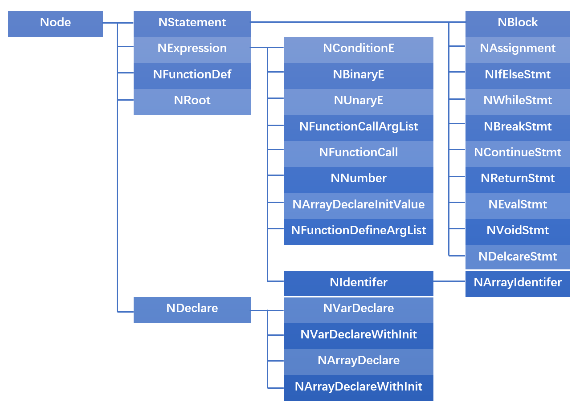

RISC-V上的SysY编译器

这是一个简单的SysY语言编译器，可以将目标代码编译为RISC-V汇编代码。SysY是C语言的一个子集，支持函数、变量、常量、条件判断等功能。SysY语言的详细介绍见https://pku-minic.github.io/online-doc/#/ 。

## Requirements

```bash
flex 2.6.4
bison 3.0.4
g++ 7.5.0
```

## Build

```bash
./build
```

## Usage

```
compiler input.sy -o output.S
```

在编译时还会输出两个中间结果文件\*.eeyore和\*.tigger，分别存储编译过程中的两种中间代码。

用RISC-V汇编代码生成可执行文件及运行的方法参考https://github.com/pku-minic/open-test-cases 。

## 代码结构


## AST定义

